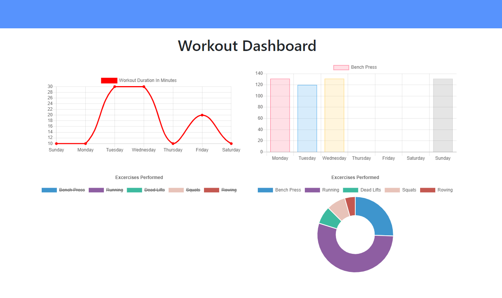

# Unit 17: Workout Tracker


Allows the user to track a workout. Various attributes of the workout can be stored. The workouts are saved in a Mongo database.

## Description

Created a fitness tracking app utilizing Node.js, Express.js, MongoDB, Heroku and Mongoose. Majority of the front end code was provided in a homework prompt as part of a web development boot camp. Allows the user to track their workouts and save them in a database.

## Live site:

https://cmojica-work-tracker.herokuapp.com/

## Images

Image of main view:


Image of adding exercises:


Image of Workout Dashboard


## Installation

To install necessary dependencies, run the following command:

```
npm i
```

You will need to npm i to get all the required node modules. If you are running the code locally the local host is set to port 3000. You will also need to go in to the config folder and possibly change the config.json values. The file I used to start the project is server.js.

## Usage

The primary purpose of this was to meet the requirements of a homework assignment. The major goal seems to be practice with MongoDB and Mongoose You could use it to track a workout, or as the basis of a workout app.

## Challenges

I underestimated the differences between querying in sequelize and Mongoose. I was struggling with handling promises associated with Mongoose. I ran into difficulty figuring out how to connect Robo 3T to mLab, which is very different than connecting MySQL Workbench to JawsDB. The last challenge was learning how to seed the mLab database on deployment of the app on Heroku. I figured out how to modify the scripts in the package.json to accomplish this task.
